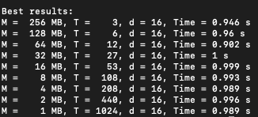

# Block
Blockchain has been getting a lot of popularity lately as people see it as the "future" of currency. This repo is exactly that. Implemented a blockchain with Flask and using Argon2d for hashing (much better than Scrypt). There are three flavors of Argon2, though in the original paper (linked below), it's suggested Argon2d is recommended for crypto, but Argon2id has shown better results when measuring the current environment running `100 times` (this will differ with different environments) with argon2-cffi. To acheive the raw hash a low level function running off C data structures has been implemented.

old_layout contains exactly how it's described, a glory hole of a mess of a layout with just a ton of bugs

new_layout contains a cleaned up space with no more bugs present

#### Reading material:
- Bitcoin: https://bitcoin.org/bitcoin.pdf
- Argon2: https://www.password-hashing.net/argon2-specs.pdf
- PoW: https://en.wikipedia.org/wiki/Hashcash?ref=hackernoon.com
- Consensus: https://www.researchgate.net/publication/330880555_Consensus_Algorithms_in_Blockchain_Comparative_Analysis_Challenges_and_Opportunities
- argon2-cffi: https://argon2-cffi.readthedocs.io/en/stable/cli.html

-----
#### Interacting with the Blockchain

- Calling the chain: `curl http://127.0.0.1:5000/chain`
- Mining a block: `curl http://127.0.0.1:5000/mine`
- Creating new nodes: `curl http://127.0.0.1:5000/nodes/register` (requires separate device or run script on different port)
- Adding a transaction: `curl -X POST -H "Content-Type: application/json" -d '{
 "sender": "Enter address",
 "recipient": "Enter address", 
 "amount": 5
}' "http://localhost:5000/transactions/new"`
- Resolve conflicts: `curl http://127.0.0.1:5000/nodes/resolve`

-----
#### Environment
- MacBook Pro (13-inch, 2020):
- Processor: 1.4 Ghz Quad-Core Intel Core i5
- Memory: 8GB @ 2133 MHz

Benchmarks:

